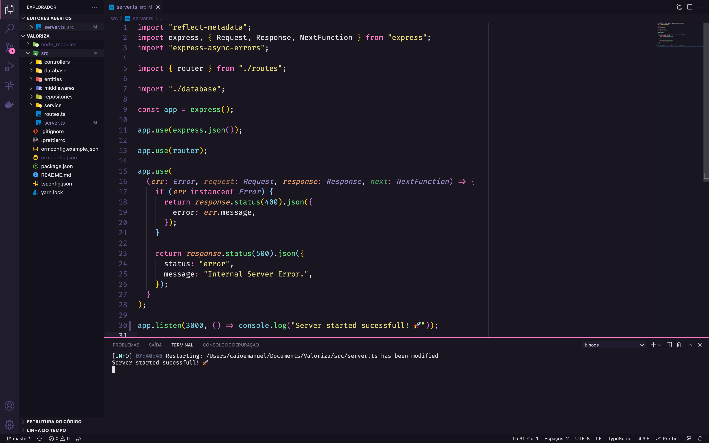

<h1 align="center">Valoriza API</h1>

  

  

  

## ✨ Tecnologias

This project was developed with the following technologies:

- [Node.js](https://nodejs.org/en/)
- [Typescript](https://www.typescriptlang.org/)
- [Express](https://expressjs.com/pt-br/)
- [JSONWebToken](https://github.com/auth0/node-jsonwebtoken#readme)

## 💻 Project

Valoriza is a platform to promote recognition among teammates.

## 🚀 How execute

- Clone the repository
- Run `yarn` to download dependencies
- Run `yarn typeorm migration:run` to create the database tables.
- Run `yarn dev` to start the application.

Finally, the application will be available at `http://localhost:3000`

## 📄 Licença

This project is under the MIT license. See the [LICENSE](LICENSE.md) file for more details.

---
Developed &nbsp;by Caio Emanuel 😄👋🏻 &nbsp;[LinkedIn](https://www.linkedin.com/in/caio-emanuel-2330011a6/)